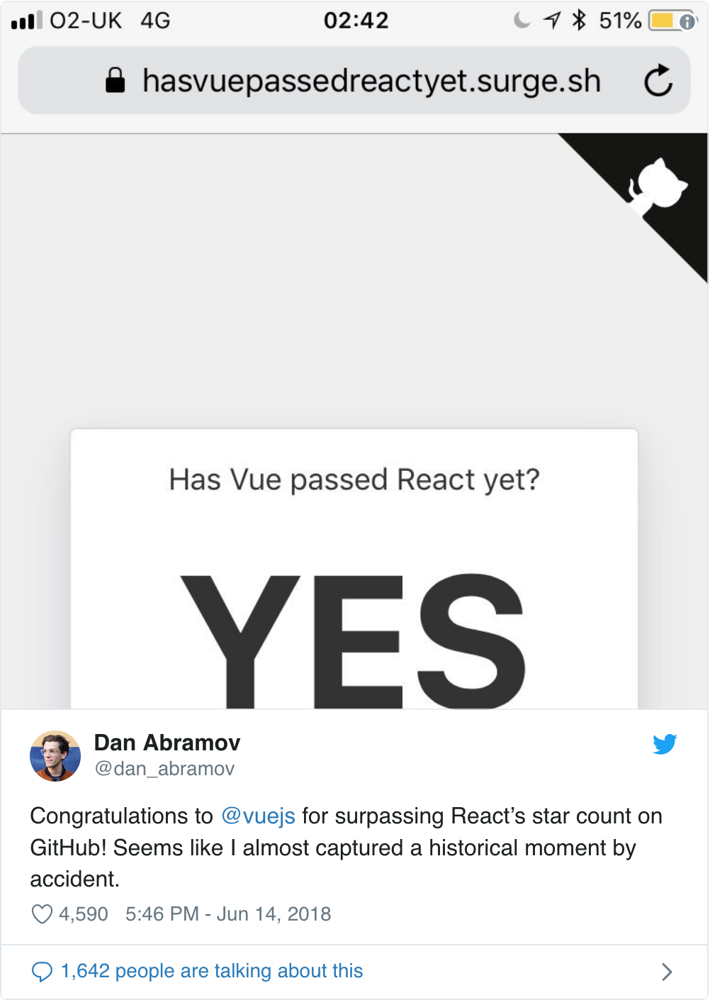
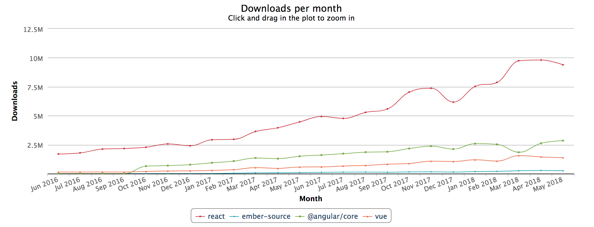
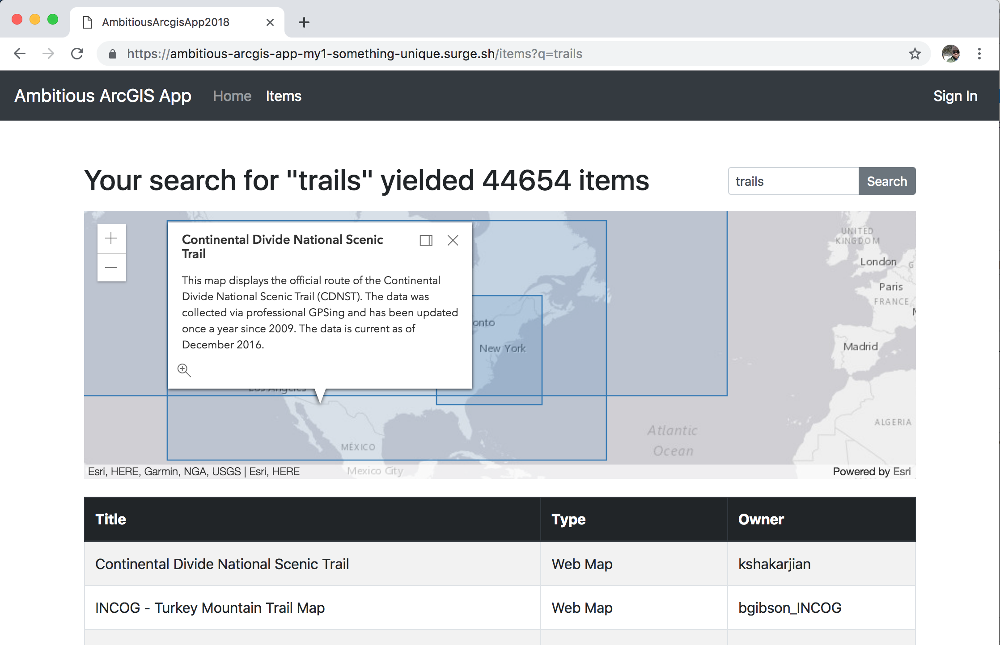
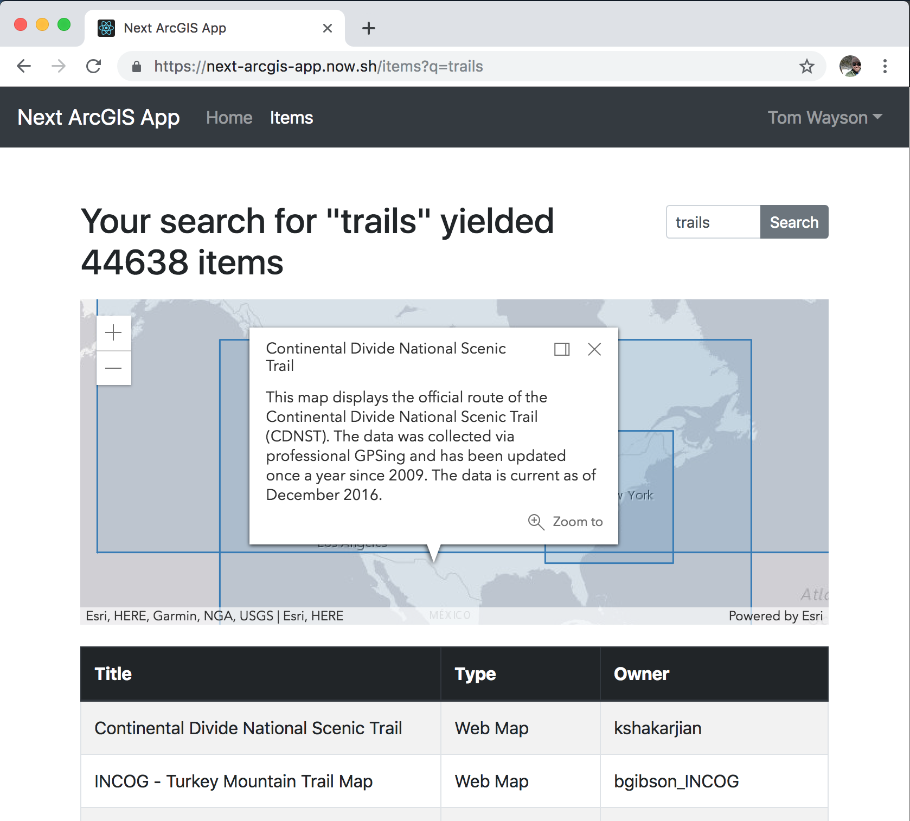

export { future as theme } from 'mdx-deck/themes'
import { Appear } from 'mdx-deck'
import { CodeSurfer } from "mdx-deck-code-surfer"
import vsDark from "prism-react-renderer/themes/vsDark"

# React for Ember Developers
---
## Why should you care about React?
---
### At Esri
Product|Framework
--|--
Hub|Ember
Ops Dashboard|Ember
Experience Builder|React
Story Maps|React
Insights|Angular
Survey 123|Angular?
---
<a href="https://zendev.com/2018/06/19/react-usage-beating-vue-angular.html"></a>
---
<a href="https://npm-stat.com/charts.html?package=react&package=vue&package=%40angular%2Fcore&package=ember-source&from=2016-06-01&to=2018-05-31"></a>
---
## Rebuilt an Ember App

<a href="http://ambitious-arcgis-app-my1-something-unique.surge.sh/"></a>

[ambitious-arcgis-app-2018](https://github.com/mjuniper/ambitious-arcgis-app-2018/)
---
## React vs Ember
---

<table>
  <tr>
    <td>
      <ul style={{listStyleType: 'none'}}>
        <Appear>
          <li>Flexible</li>
          <li>Innovative</li>
          <li>"View layer"</li>
        </Appear>
      </ul>
    </td>
    <td></td>
    <td>
      <ul style={{listStyleType: 'none'}}>
        <Appear>
          <li>Opinionated</li>
          <li>Stable</li>
          <li>Heavy</li>
        </Appear>
      </ul>
    </td>
  </tr>
</table>
---
## Philosophy
---
### Ember

<Appear>
<p>Stability without Stagnation</p>
<p>Convention > Configuration</p>
</Appear>
---
### React
```js
ui = f(s)
```
<ul>
<Appear>
  <li>Fetching data?</li>
  <li>User interactions?</li>
</Appear>
</ul>
---
## Tooling
---
### Ember CLI
```bash
ember new my-new-app
cd my-new-app
ember test
ember serve
ember generate route items
```
---
### React

[create-react-app](https://github.com/facebook/create-react-app) - [Next.js](https://nextjs.org/) - [Gatsby](https://www.gatsbyjs.org/)
---

Like Ember CLI, each:
<ol>
  <Appear>
  <li>installs dependencies & tooling</li>
  <li>insulates devs from low-level tooling</li>
  <li>has (a few) opinions on folder structure</li>
  <li>has commands to run & build app</li>
  </Appear>
</ol>

```notes
no sub commands for generating routes, components, etc
```
---
Emphasize docs/examples for the rest:
<ul>
  <li>Styling components (CSS in JS, Sass, etc)</li>
  <li>Installing & using libraries</li>
  <li>Running tests</li>
  <li>Deployment</li>
</ul>
---
&nbsp;|create-react-app|Next.js|Gatsby
--|--|--|--
Key Feature|official support/docs|SSR, route-based data fetching & code-splitting|static site generation, ecosystem
Best Uses|simple apps, learning React|data-centric apps|content-centric apps
Owner|Facebook|Zeit (Now)|Gatsby.com
---
### Which did I choose?
<Appear>
<p>create-react-app</p>
<p>... and Next.js</p>
</Appear>
---
## Create ArcGIS App

<a href="https://create-arcgis-app.surge.sh/"></a>

[create-arcgis-app](https://github.com/tomwayson/create-arcgis-app)
---
## Next ArcGIS App

<a href="https://next-arcgis-app.now.sh/"></a>

[next-arcgis-app](https://github.com/tomwayson/next-arcgis-app)
---
## Architecture
---
### Ember

Routes do everything
---
```
datasets
├── dataset
│   ├── data
│   │   ├── controller.js
│   │   ├── route.js
│   │   └── template.hbs
│   ├── overview
│   │   ├── controller.js
│   │   ├── route.js
│   │   └── template.hbs
│   ├── controller.js
│   ├── route.js
│   └── template.hbs
├── index
│   ├── controller.js
│   ├── route.js
│   └── template.hbs
├── index-loading
│   └── template.hbs
├── controller.js
└── template.hbs
```
---
### React

Everything is a component
---
Ember|React
--|--
Router|Component
Route|Component
Controller|Component
Template|Component
Component|Component
Helper|Component
Ember Data|GraphQL
Service|Redux or Context
Util|ES Module
Initializer|index.js
---
## Templates vs JSX
---
### Search Form Component

<p></p>
---
<CodeSurfer
  theme={vsDark}
  title="Parent Template (items.hbs)"
  code={require("!raw-loader!./items.hbs")}
  lang="handlebars"
  showNumbers={false}
  dark={true}
  steps={[
    { lines: [6] }
  ]}
/>
---
<CodeSurfer
  theme={vsDark}
  title="Handlebars Template"
  code={require("!raw-loader!./ago-search.hbs")}
  lang="handlebars"
  showNumbers={false}
  dark={true}
  steps={[
    { lines: [3], notes: "text input captures search term"},
    { tokens: { 3: [13, 14, 15] }, notes: "bound to `searchCopy`" },
    { lines: [1, 8] },
    { tokens: {1: [3, 4, 5, 6, 7, 8, 9, 10, 11, 12, 13, 14, 15]}, notes: "{{action}} helper passes search term to parent" },
    { tokens: { 3: [15], 1: [9] }, notes: "where does `searchCopy` come from?" },
    { tokens: { 2: [6] }, notes: "what about `sizeClass`?" }
  ]}
/>
---
<CodeSurfer
  theme={vsDark}
  title="Component JS"
  code={require("!raw-loader!./ago-search.js")}
  lang="javascript"
  showNumbers={false}
  dark={true}
  steps={[
    { lines: [9, 12], notes: "CPs are derived from properties" },
    { lines: [6], notes: "what is this doing here?" }
  ]}
/>
---
<CodeSurfer
  theme={vsDark}
  title="Parent JSX"
  code={require("!raw-loader!./ItemsLayout.js")}
  showNumbers={false}
  dark={true}
  steps={[
    { range: [36, 41], notes: "invocation not much different" },
    { range: [2, 5], notes: "have to import components before you can use them" }
  ]}
/>
---
<CodeSurfer
  theme={vsDark}
  title="Component JSX"
  code={require("!raw-loader!./AgoSearch.js")}
  showNumbers={false}
  dark={true}
  steps={[
    { notes: "Component is a single file"},
    { range: [4, 12], notes: "searchCopy: computed.reads('q')" },
    { range: [13, 21], notes: '{{action onSearch searchCopy on="submit"}}' },
    { tokens: {24:[2], 27:[7]}, notes: 'proximity to vars makes it easier to grok' },
    { tokens: {25:[2], 28:[7]} }
  ]}
/>
---
# The end
