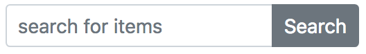

export { future as theme } from 'mdx-deck/themes'
import { CodeSurfer } from "mdx-deck-code-surfer"
import vsDark from "prism-react-renderer/themes/vsDark"

### Search Form Component

---
<CodeSurfer
  theme={vsDark}
  title="Invocation (items.hbs)"
  code={require("!raw-loader!./code/items.hbs")}
  lang="handlebars"
  showNumbers={false}
  dark={true}
  steps={[
      { range: [6, 11] }
  ]}
/>
---
<CodeSurfer
  theme={vsDark}
  title="Invocation (Items.jsx)"
  code={require("!raw-loader!./code/ItemsLayout.js")}
  showNumbers={false}
  dark={true}
  steps={[
    { range: [36, 41], notes: "invocation not much different" },
    { lines: [3], notes: "have to import components before you can use them" }
  ]}
/>
---
<CodeSurfer
  theme={vsDark}
  title="Component JSX"
  code={require("!raw-loader!./code/AgoSearch.js")}
  showNumbers={false}
  dark={true}
  steps={[
    { notes: "Component is a single file"},
    { range: [4, 12], notes: "searchCopy: computed.reads('q')" },
    { range: [13, 21], notes: '{{action onSearch searchCopy on="submit"}}' },
    { tokens: {24:[2], 27:[7]}, notes: 'proximity to vars makes it easier to grok' },
    { tokens: {25:[2], 28:[7]} }
  ]}
/>
---
<CodeSurfer
  theme={vsDark}
  title="Handlebars Template"
  code={require("!raw-loader!./code/ago-search.hbs")}
  lang="handlebars"
  showNumbers={false}
  dark={true}
  steps={[
    { tokens: { 3: [15], 1: [9] }, notes: "where does `searchCopy` come from?" },
    { tokens: { 2: [6] }, notes: "what about `sizeClass`?" }
  ]}
/>
